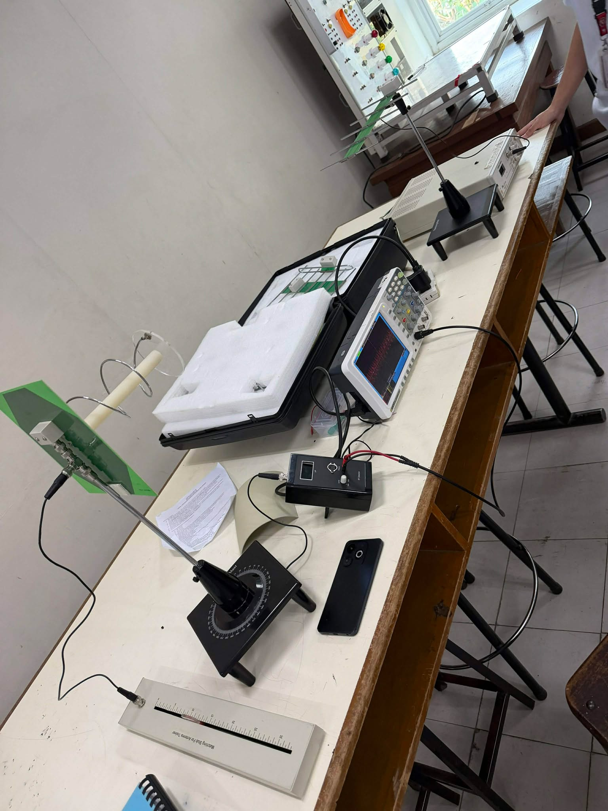
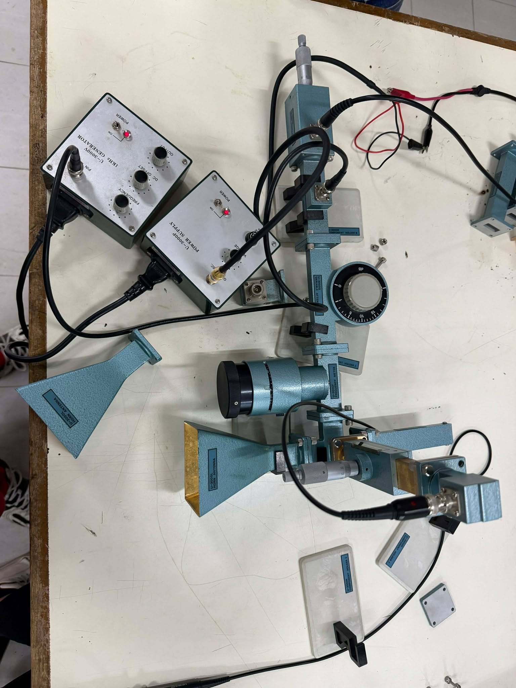

# 📡 Antennas & Waveguides
> **Practical exploration of microwave signal transmission, waveguide component mapping, and directional antenna reception.**

---

> [!IMPORTANT]
> - **Domain:** `RF Engineering`
> - **Platform:** `Antenna & Waveguide Training System`
> - **Core Objective:** Investigate the transition between guided wave propagation and free-space reception via directional antenna arrays.
> - **Key Outcome:** Identified critical hardware variables, such as **flange alignment**, that directly influence signal continuity and link integrity.

---

### 🛠️ Technical Skillset & Competencies
*   **Microwave Systems:** Foundational knowledge of signal transmission through guided and radiated media.
*   **Hardware Configuration:** Hands-on experience identifying and mapping physical components.
*   **Antenna Reception:** Practical analysis of signal acquisition using **Yagi–Uda** configurations.
*   **RF Fundamentals:** Understanding the role of **Impedance Matching**, **SWR**, and **Signal Modulation**.

---

## 📋 Table of Contents
* [🎯 Objectives](#objectives)
* [📖 Theoretical Background](#theory)
* [📡 Antenna Inventory & Analysis](#inventory)
* [🛠️ Quick Start: Antenna & Waveguide Setup](#setup)
* [🔬 Laboratory Observations](#observations)
* [💡 Key Takeaways](#takeaways)
* [📈 Final Conclusion](#conclusion)
---

## 🎯 Objectives

<b>View Details</b>

*   **Signal Transformation:** Master the role of antennas in converting electrical signals to radiated EM waves.
*   **Guided Propagation:** Analyze waveguide structures to minimize signal loss and maximize transmission efficiency.

---

## 📖 Theoretical Background
*Core principles governing Yagi–Uda directivity and specialized waveguide components.*

<b>View Theory & Physics</b>

### x
Antennas act as electromagnetic transducers, converting electrical signals into radiated waves.
*   **Yagi–Uda Configuration:** Utilized for high directivity, using reflectors and directors to focus energy along a main lobe.
*   **Horn Antenna:** Acts as a high-gain aperture radiator, providing a seamless impedance transition from the waveguide to free space.
*   **Polarization:** Precise alignment of transmitting and receiving elements is required for maximum power transfer.

### Waveguide Component
Proper signal management requires a specific sequence of microwave hardware:
*   **Microwave Source:** Generates the high-frequency carrier (Klystron or Gunn Oscillator).
*   **Isolator:** A non-reciprocal device that protects the source by preventing reflected power from returning.
*   **Frequency Meter:** A cavity resonator used to verify the exact operating frequency of the system.
*   **Variable Attenuator:** Absorptive device used to control signal intensity without changing the SWR.
*   **Slide Screw Tuner:** Introduces variable reactance to cancel reflections and achieve **Impedance Matching**.
*   **Slotted Line:** A fundamental tool for observing standing wave patterns and E-field distribution.
*   **Termination Load:** A matched load designed to absorb all incident power, preventing unwanted reflections at the end of the chain.

### Waveguide Physics
*   **Dominant Mode:** Rectangular waveguides operate in **TE₁₀ mode** for stable propagation.
*   **Signal Modulation:** Utilized **1 kHz square wave modulation** to facilitate signal detection via the detector mount and oscilloscope.

---

## 📡 Antenna Inventory & Characterization
*Evaluated a diverse range of antenna geometries to analyze gain, directivity, and polarization.*

  
| Category | Antenna Type | Technical Focus |
| :--- | :--- | :--- |
| **High-Gain Arrays** | **Yagi-Uda (7-Element)** | Maximum forward gain & narrow beamwidth optimization. |
| | **Yagi-Uda (6-Element)** | Comparative analysis of parasitic element scaling. |
| | **Log-Periodic (LPDA)** | Wideband frequency response and impedance stability. |
| **Aperture** | **Standard Gain Horn** | Microwave waveguide-to-free-space transition. |
| **Wire / Fundamental** | **Folded Dipole** | Impedance matching for driven elements (300Ω). |
| | **Monopole / Simple Dipole** | Standard omnidirectional radiation patterns. |
| | **Loop Antenna** | Magnetic field (H-field) reception characteristics. |
| **Circularly Polarized**| **Helical Antenna** | Axial mode propagation for satellite link simulation. |

---

## 🛠️ Quick Start: Antenna & Waveguide Setup
*Standard Operating Procedure (SOP) for signal validation and directional alignment.*

### 1️⃣ Component Sequence (Signal Chain)
1. **Signal Source:** High-frequency generator (stabilized for the target band).
2. **Waveguide Section:** Standard rectangular waveguide for guided mode propagation.
3. **Transition Adapter:** Waveguide-to-Coaxial adapter to feed the antenna elements.
4. **Driven Element:** Connect the dipole section of the **Yagi-Uda** array.
5. **Parasitic Elements:** Correctly space the **Reflector** and **Directors** on the boom.
6. **Receiving Station:** Identical antenna or probe to capture the transmitted signal.

### 2️⃣ System Alignment & Configuration
*   **Element Spacing:** Ensure the Reflector (longer) and Directors (shorter) are seated firmly to focus the beam.
*   **Polarization Sync:** Align both antennas (Horizontal or Vertical) to prevent cross-polarization signal loss.
*   **Mechanical Integrity:** Check that the waveguide flange is flush to ensure a stable "Guided-to-Free-Space" transition.

> [!TIP]
> **Hardware Precision:** Always verify **flange alignment** before testing. Even slight gaps between waveguide sections cause signal leakage and impedance mismatches, which directly degrade the gain of high-element Yagi arrays.

---

## 🔬 Laboratory Observations
*Direct visual evidence of the microwave signal chain and signal acquisition performance.*

<b>View Setup & Media Gallery</b>

  <strong>Antenna Trainer & Transmitter Setup</strong> 
  
  
  

  <strong>Yagi–Uda Receiver Configuration</strong> 
  
  

  <strong>Signal Validation & Performance (Lab Videos)</strong> 
  <a href="assets/Antenna/Antenna%20Setup.mp4"><strong>Antenna Setup Demo</strong></a> 
  <a href="assets/Antenna/Antenna%20(Output).mp4"><strong>Oscilloscope Signal Output</strong></a>

---

  <strong>Waveguide Bench Mapping</strong> 
  
  

  <strong>Component Details</strong> 
  
  
  

---

## 💡 Key Takeaways
*Practical experience in RF system assembly, signal validation, and hardware configuration.*

<b>View Project Analysis</b>

### Successful Implementation: Antenna Transmission
*   **System Validation:** Successfully established a wireless link using the **Yagi–Uda antenna** configuration.
*   **Impedance Optimization:** Leveraged a **Slide Screw Tuner** to match impedance and ensure maximum power transfer to the receiver.
*   **Directivity:** Observed how precise antenna alignment directly impacts signal strength on the oscilloscope.

### Learning Milestone: Waveguide System Assembly
The waveguide portion of the lab focused on the complex physical architecture required for guided-wave propagation. While the setup did not produce a final output, it provided critical hands-on experience:
*   **Hardware Integration:** Gained technical proficiency in the sequential assembly of the microwave bench.
*   **Assembly Precision:** Learned how to align and secure waveguide flanges, a fundamental skill for maintaining signal integrity at high frequencies.
*   **Component Mapping:** Developed a deep understanding of the signal chain, from the microwave source through the various modulation and measurement stages.

### Skills Gained
*   **System Configuration:** Expertly mapped and assembled a multi-stage microwave hardware chain.
*   **Technical Awareness:** Gained a realistic understanding of how physical tolerances and hardware conditions (such as oxidation) affect link reliability.
*   **Adaptability:** Successfully pivoted to the antenna setup to validate transmission logic when the guided path encountered hardware-level limitations.

---

## 📈 Final Conclusion
The session successfully validated the significance of waveguides and antennas in microwave systems. This project serves as a technical springboard for advanced RF and microwave engineering.

---

<a href="#readme-top">Back to top ↑</a>

